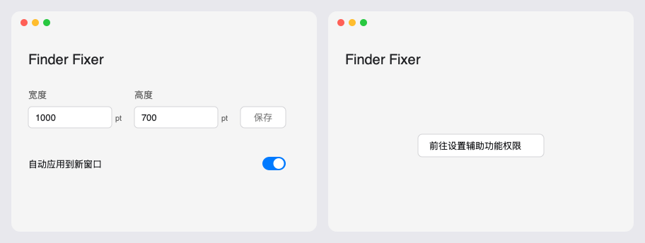

# Finder Fixer


Give every new Finder window your preferred size.

[简体中文](README.md) · [Contributing](CONTRIBUTING.md) · [MIT License](LICENSE)

A small native macOS menu bar utility. Set a width and height once; new standard Finder windows are resized once, then remain free to move and resize manually. The app UI is currently in Simplified Chinese.

## Features

- Fixed dimensions, defaulting to **1000 × 700 points**, stored locally.
- Existing windows stay unchanged when the app starts or settings are saved.
- No snapping back after manual resizing. Tabs, refocusing and restoring minimized windows do not trigger another resize.
- Toggle automatic resizing or quit from the menu bar to stop monitoring.
- Built with SwiftUI, AppKit and Accessibility APIs. No third-party runtime dependencies, accounts, telemetry or network services.



*Design preview, not a runtime screenshot.*

## Build and run

This is a source-only preview release. No Developer ID-signed or notarized installer is provided. Full Xcode and its command-line tools are required.

```sh
git clone https://github.com/Luvisdaisy/finder-fixer.git
cd finder-fixer
./scripts/build.sh
open build/Build/Products/Release/finder-fixer.app
```

1. Add and enable the built app in **System Settings → Privacy & Security → Accessibility**.
2. Open **设置** (Settings) from the menu bar. Enter **宽度** (width) and **高度** (height), click **保存** (Save), and enable **自动应用到新窗口** (apply to new windows).
3. Open a new Finder window with ⌘N.

Dimensions describe the window's outer frame in logical points, not pixels. Finder's own minimum size and the available screen area may constrain the result. Closing settings leaves the app running; choose **退出** (Quit) from the menu bar to stop it.

Rebuilding an ad-hoc-signed app may require removing its old Accessibility entry and adding the new build. Permission is used to inspect and resize Finder windows, not to read file contents. See [privacy](PRIVACY.md) and the [usage guide](docs/usage.md) (Chinese).

## Compatibility

The app targets macOS 13+; the test target requires macOS 14+. Local builds have been verified with Xcode 27. Previous desktop validation covered macOS 26.6.2 on Apple Silicon with one display. Other OS versions, Intel, multiple displays and complete VoiceOver workflows have not been manually verified.

Fullscreen, minimized and nonstandard windows are skipped. Tiled/maximized windows are subject to system layout constraints. Launch at login, automatic updates and per-folder preferences are not implemented.

## Development

```sh
./scripts/build.sh Debug
./scripts/test.sh
```

Open `finder-fixer.xcodeproj` directly; project generation is optional. XCTest hosts do not start the Finder service or show app UI. CI build/unit-test results do not establish desktop integration compatibility.

Source modules: `App` handles lifecycle and menus; `Settings` manages UI and drafts; `WindowManagement` observes Finder and applies geometry policies; `Infrastructure` handles permissions and persistence.

[Architecture](docs/design.md) · [Testing](docs/manual-testing.md) · [Changelog](CHANGELOG.md) · [Release process](docs/releasing.md). Detailed engineering docs are currently in Chinese.

## Feedback and license

Use [Issues](https://github.com/Luvisdaisy/finder-fixer/issues) for reproducible bugs and focused feature requests. Include macOS version, CPU architecture and display setup; redact private filenames and paths. See [SECURITY.md](SECURITY.md) for vulnerability reporting.

Released under the [MIT License](LICENSE). Finder and macOS are Apple trademarks. This independent project is not affiliated with or endorsed by Apple.
