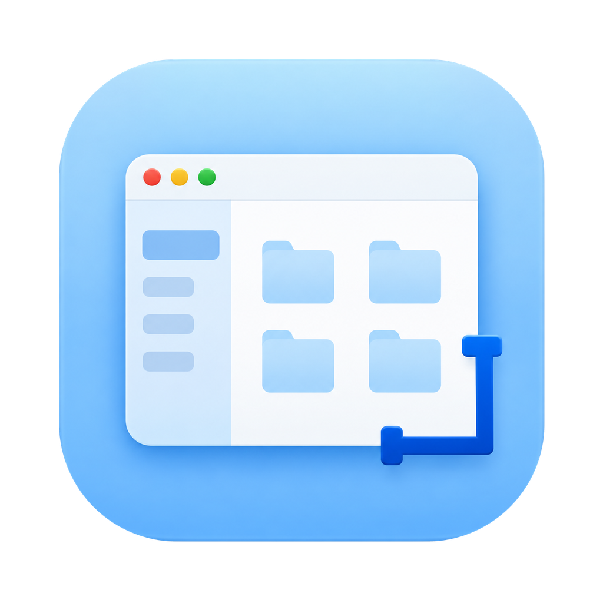
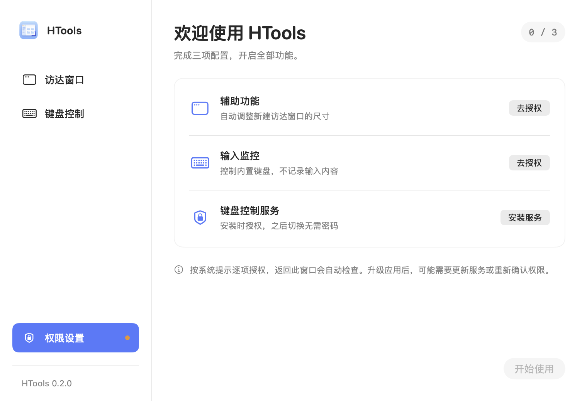
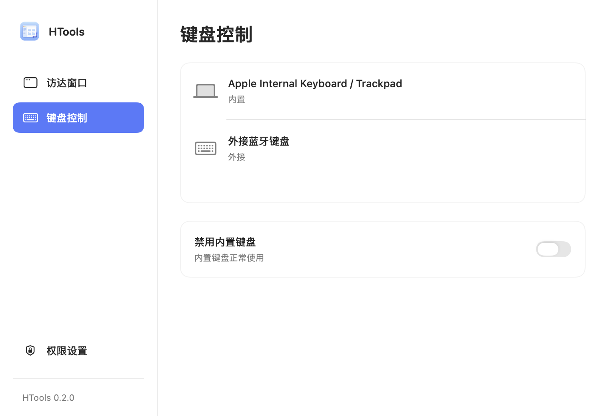

# HTools



让新建访达窗口保持合适的尺寸，用外接键盘时按需禁用内置键盘。

[下载 v0.2.0](https://github.com/Luvisdaisy/finder-fixer/releases/tag/v0.2.0) · [English](README.en.md) · [安装与更新](INSTALL.md) · [使用指南](docs/usage.md)

HTools 是原 Finder Fixer 的新版本，一个原生 macOS 菜单栏工具，无账号、联网服务和第三方运行依赖。

## 功能

- **访达窗口**：设置宽高后，只调整之后新建的标准窗口；已有窗口、手动缩放和标签页不受影响。默认尺寸为 1000 × 700 pt，可随时关闭自动应用。
- **键盘控制**：显示当前内置和外接键盘；连接可信外接键盘后，可暂时禁用内置键盘。关闭开关、退出、选定外接断连或睡眠会结束本次禁用，不自动重新开启。
- **统一权限**：首次在同一页配置辅助功能、输入监控和键盘服务。安装服务时由 macOS 请求管理员授权，后续切换无需重复输入密码；同时检查后台进程是否真正获得输入权限。
- **清晰的状态**：未授权页只显示权限入口；保存状态、连接中和恢复中直接可见。菜单栏提供设置、权限设置和退出入口。

界面目前为简体中文。以下为实际 SwiftUI 组件使用示例状态的离屏渲染，**不是实机授权或硬件测试截图**。




## 安装与使用

1. 下载 `HTools-0.2.0-universal.dmg`，打开后将 `HTools.app` 拖入“应用程序”。
2. 推出 DMG，打开安装后的 HTools，依次完成权限页的三项配置。
3. 在“访达窗口”保存宽高，或在“键盘控制”打开禁用开关。

这是免费预览版：**临时签名，无 Developer ID 签名或 Apple 公证**。首次打开可能被系统拦截，仅在确认来源可信时按系统“仍要打开”流程操作。详见 [INSTALL.md](INSTALL.md)。

更新时先退出旧程序，用新 App 替换；在权限页更新键盘服务，系统也可能要求重新添加隐私权限。卸载前先从权限页的“管理服务”移除服务，再删除 App。关闭设置窗口不会退出菜单栏应用。

## 兼容性与验证边界

| 项目 | 状态 |
| --- | --- |
| 部署目标 | macOS 13+，通用 arm64 / x86_64 安装包 |
| 已验证环境 | macOS 26.6.2、Apple Silicon |
| 键盘实际反馈 | 用户已确认修正后台权限后的集成版可用 |
| 自动化 | 尺寸策略、偏好迁移、设备筛选、IPC、会话与权限判定测试；构建、签名与 DMG 检查 |
| 待覆盖 | Intel、旧 macOS、多屏、完整 VoiceOver、USB/蓝牙断连、崩溃和睡眠恢复的系统化物理矩阵 |

按键功能不承诺屏蔽电源键或 Touch ID。设备识别有歧义、没有可信外接键盘时拒绝启用。后台心跳失联 3 秒尝试释放，5 秒独立保护退出；这不能替代真实硬件恢复测试。详见 [验证记录](docs/manual-testing.md) 和 [隐私说明](PRIVACY.md)。

## 从源码构建

需要完整 Xcode 和命令行工具。

```sh
git clone https://github.com/Luvisdaisy/finder-fixer.git HTools
cd HTools
./scripts/build.sh
open build/Build/Products/Release/HTools.app
```

```sh
./scripts/test.sh          # 不安装服务、不执行键盘禁用
./scripts/package-dmg.sh   # 生成通用 DMG 和 SHA-256
```

打开 `HTools.xcodeproj` 即可开发。新增 Swift 文件后运行 `python3 scripts/create-project.py`。

[架构](docs/design.md) · [界面设计](docs/ui-design.md) · [贡献指南](CONTRIBUTING.md) · [发布流程](RELEASING.md) · [更新记录](CHANGELOG.md)

GitHub 仓库地址保留原 URL，旧发布历史保留；当前应用、工程与产品均名为 HTools。采用 [MIT](LICENSE) 许可证。Finder 和 macOS 为 Apple 商标，本项目与 Apple 无隶属或背书关系。
