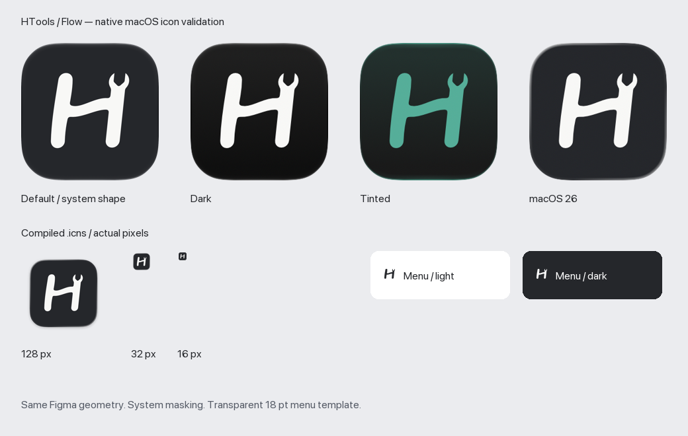

# HTools Flow artwork

The app and menu bar use **01 / Flow — Recommended**, approved from the
[Figma design](https://www.figma.com/design/sN4n2YHxB5kA22NAj1jmPv/Untitled?node-id=7-79).
The H/tool mark retains the original six-degree lean, curved bridge and open jaw.

## Source and runtime assets

- `htools-flow-figma.svg`: exact 1024 × 1024 Figma export; canonical geometry.
- `../HTools/Resources/AppIcon.icon`: native Icon Composer document. The background is opaque charcoal `#25272B`; `Assets/flow.svg` contains only the original off-white `#F7F7F5` foreground path. No hand-drawn mask, glow or shadow is baked into these layers. Foreground glass effects and group shadow are disabled to preserve the simple line silhouette.
- `app-icon.png`: Apple-rendered 1024 px preview for documentation; it is not the runtime icon source.
- `../HTools/Resources/Assets.xcassets/MenuBarIcon.imageset`: transparent, black template images at 18 × 18 and 36 × 36 px. The proportional 16 pt glyph has at least 1 pt padding; AppKit supplies appearance-dependent color.

Xcode 26+ compiles `AppIcon.icon`, applies the platform's rounded shape and appearance treatment, and automatically generates compatible images / `AppIcon.icns` for older macOS releases. The app deployment target remains macOS 13. Source layers stay square and unmasked; do not apply another rounded mask or pad the full-bleed background. The previous PNG app icon set and old blue source artwork have been removed; Git history retains them.

## Regeneration

Requires full Xcode 26+ (Icon Composer) and Python with Pillow. Normal app builds need neither Python nor Pillow because runtime resources are checked in.

```sh
python3 -m venv .venv
.venv/bin/python -m pip install 'Pillow>=10,<13'
.venv/bin/python scripts/create-app-icon.py
```

The script preserves the Figma vector coordinates, separates the background, exports a platform preview using Apple's `ictool`, and uses AppKit plus Pillow to rasterize the menu templates. Update the checked-in Figma export when changing the approved design; keep `AppIcon.icon/icon.json` background settings aligned with it.

## Apple guidance

- [App icons — Human Interface Guidelines](https://developer.apple.com/design/human-interface-guidelines/app-icons): simple recognizable silhouette, square 1024 px layers, system masking, legibility at small sizes, consistent appearance variants.
- [Creating your app icon using Icon Composer](https://developer.apple.com/documentation/xcode/creating-your-app-icon-using-icon-composer): vector foreground layers, native background, automatic compatibility images for previous OS releases.

The design artwork is available under the repository MIT license. No Apple artwork or trademarks are incorporated.

## Verified locally

Xcode 27 Release universal build and strict code signature verification passed. The compiled asset catalog contains AppIcon renditions through 1024 px and both template image scales. The generated compatibility `.icns` and Default, Dark, TintedDark and macOS 26 renderer outputs were visually reviewed. This is icon/resource validation, not a physical test on every supported OS.


