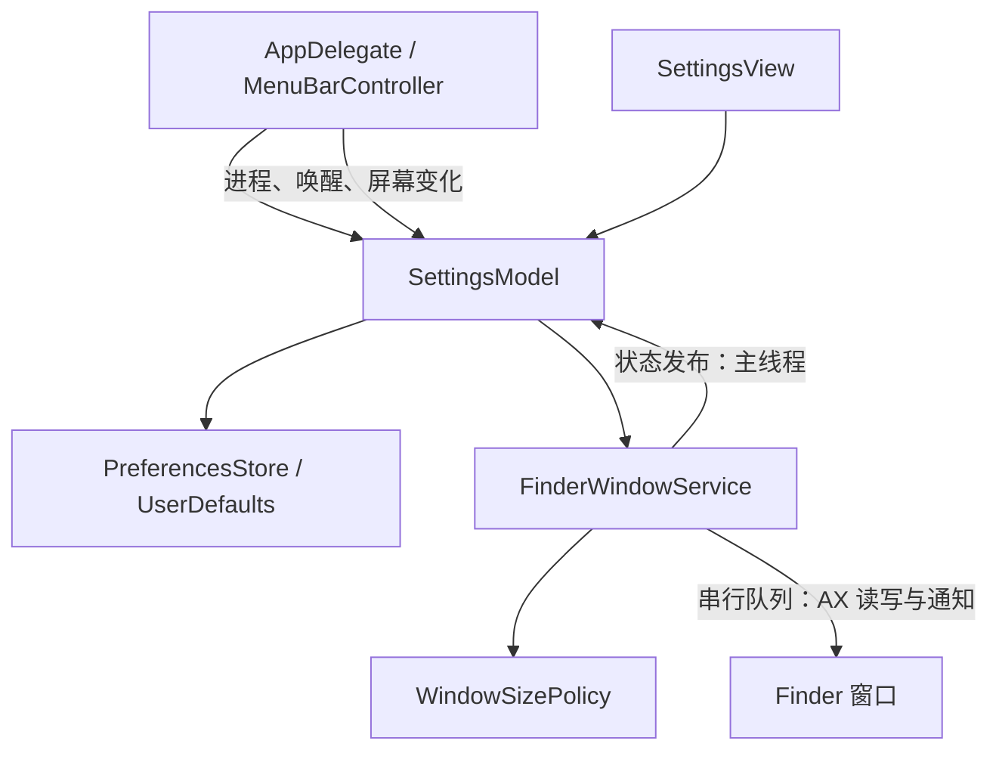

# 架构与实现

单进程 macOS 原生菜单栏应用。核心行为是对新建的标准 Finder 窗口应用一次固定尺寸。

## 结构

- `App/`：AppKit 生命周期、NSStatusItem / NSMenu、设置窗口及显示器和访达进程通知。
- `Settings/`：SwiftUI 单页设置、草稿校验和授权驱动的 UI 状态。
- `WindowManagement/`：窗口识别、AXObserver、固定尺寸策略及单次应用。
- `Infrastructure/`：辅助功能授权入口与 UserDefaults 存储。

路径相对于 `finder-fixer/`。保留按职责分层的单个应用 target，不引入额外框架或包。Xcode 导航分组与源码目录对应。

设置变更经 `SettingsModel` 校验、持久化并传入服务；窗口实际尺寸不会反写偏好。`WindowSizePolicy` 是纯几何逻辑，可脱离桌面测试。`FinderWindowService` 负责有系统副作用的窗口操作。

## 默认与约束

固定默认 1000 × 700 pt，自动应用开启，输入 100–10000 的整数。内部保留有效浮点尺寸，比较容差 1 pt。输入范围是产品边界；本机窗口写 100 × 100 后回读 528 × 308，不将该值作为所有 Finder 布局的统一最小尺寸。

App 部署目标 macOS 13，真实测试环境 macOS 26.6.2 / arm64。Xcode 27 随附 XCTest 库最低版本更高，测试 target 单独使用 macOS 14，不改变应用部署目标。旧系统和 Intel 未实机验证。

## 观察和执行

AXObserver source 位于主 RunLoop common modes，回调立即转交专用串行队列。AX 阻塞读写、窗口记录和待执行操作均在该队列，单次 AX messaging timeout 0.5 秒，UI 更新主线程。

每 2 秒检查权限和访达 PID，并刷新状态；窗口创建主要依赖 AXWindowCreated。新进程、授权恢复及首次启动枚举作为基线，不调整既有窗口。设置页只依赖授权状态，没有手动批量应用路径。

新窗口创建后等待 150 毫秒应用一次。属性未就绪最多额外检查 3 次，间隔 150 / 300 / 450 毫秒。进程代次和配置代次阻止过期任务；窗口关闭、最小化、屏幕变化及重新配置取消待执行操作。鼠标仍按下时跳过自动应用，避免在拖动期间争抢窗口。写入失败记录内部状态，不无限重试。

仅注册创建、焦点、关闭和最小化等所需通知，不监听尺寸变化以采集偏好。全屏和最小化窗口排除。非标准窗口、桌面和对话框不纳入集合。

## 几何与存储

以主屏高度把 AppKit 左下原点转换为 AX 左上原点。选择最大交集屏幕，完全离屏时选择最近屏幕；限制到 visibleFrame，保留或必要修正位置。按实际回读再次修正位置，系统尺寸约束不覆盖用户偏好。

存储仍使用 `windowPreferences.v1`，只包含 fixedSize 和 autoApplyEnabled。旧双模式字段由 Codable 忽略，下一次保存删除；固定参数独立保留。无效数据回退，不保存无效尺寸。配置代次使已过时的自动调整任务失效。

## 构建与签名

`finder-fixer.xcodeproj` 与共享 Scheme 可直接构建；无外部运行依赖。`scripts/create-project.py` 仅为可选工程引用生成工具。

Bundle ID `local.finder-fixer`，App Sandbox 关闭，本机 ad-hoc 签名。临时签名绑定构建 cdhash，更新后可能需要删除旧辅助功能条目并重新添加当前 `.app`。不修改 TCC 数据库、不自动授权。Developer ID、公证及安装器未配置。

## 限制

- 无统一可靠的平铺／最大化 AX 标记，自动调整可能受系统布局限制；系统布局不会更改固定偏好。
- 系统最小尺寸大于屏幕可用区域时无法保证完全容纳，不修改原偏好。
- 多屏、旧系统、Intel 和完整故障注入未实测；详细记录见 [manual-testing.md](manual-testing.md)。

## 极简设置生命周期

432 × 280pt 固定内容区，标题与系统语义配色。已授权仅显示宽高、保存和自动开关；未授权主体居中显示系统权限入口。复用权限轮询及激活刷新，窗口复用、取消最小化并置前。已授权关闭验证草稿；未授权关闭或退出不验证、不保存隐藏草稿，进程内保留其内容。

## 工程与资源维护

共享工程与 Scheme 提交到版本控制，普通构建无需生成步骤。`scripts/create-project.py` 使用 Python 标准库生成确定性的文件引用、模块分组与构建配置。新增/删除 Swift 文件后重新生成，CI 检查生成结果是否与提交一致。配置以生成器为准，不能仅修改生成的工程。

图标源图位于 `assets/`，已生成资源位于 `Resources/Assets.xcassets/`。`scripts/create-app-icon.py` 是可选的 Pillow 开发工具，不是应用运行依赖。

## 生命周期与已知失败边界

首次连接、Finder 重启、权限恢复时将当前窗口枚举为基线，因此连接期间漏过的窗口不保证补调。创建通知注册异常时暂停自动应用；内部状态记录故障，但当前设置页不呈现完整运行状态。队列隔离、代次校验和取消机制旨在减少竞态，其真实桌面组合覆盖仍有限。

测试宿主在应用启动入口提前返回，不创建服务和菜单。CI 只验证构建与组件行为，真实桌面集成仍按手工流程验收。
