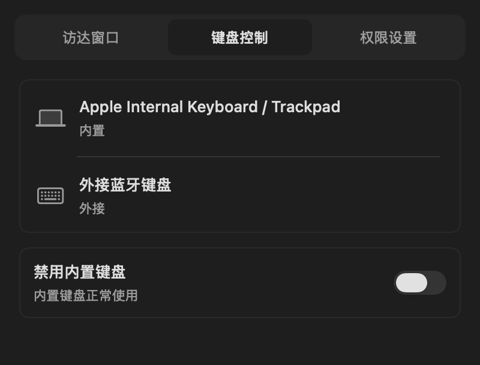

# HTools 界面与流程

设置使用固定在菜单栏图标下方的原生 NSPopover，无标题栏、红黄绿控制按钮，不可拖拽或分离为窗口。左键开合，右键（或 Control 点击）仅提供“设置”和“退出”两项纯文字，不显示图标、状态列或快捷键；Esc、⌘W 或点击面板外部可收起。有效尺寸草稿在离开时保存；无效草稿会保留面板并显示修正入口。系统服务授权期间保持面板，避免中断流程。隐藏面板不会退出应用，也不会改变键盘开关。

面板宽 400 pt，使用顶部三个文字标签代替侧栏，随当前内容调整高度：访达正常状态 196 pt，无效输入 218 pt；未授权功能页 156 pt；权限页 348 pt；键盘页根据设备数显示最多三行，更多设备滚动查看。系统负责菜单栏锚点定位和屏幕边界约束。

- 访达：宽高、保存与自动应用直接呈现，无重复页标题或卡片外框；单位为 pt，错误就地提示。
- 键盘：64 pt 设备行，名称最多两行；独立开关区显示正常、连接中、禁用或恢复中，保留连接外接键盘的安全门槛。
- 权限：0–3 完成进度；用途、状态和下一步在同一行，区分安装、更新、后台未就绪；管理菜单保留重装或移除服务。
- 未授权功能页：正文仅显示“前往权限设置”。权限标签保留橙色待配置提示。
- 系统字体、系统浅深色背景、紧凑留白；不再重复展示应用大图标、版本和页标题。

组件渲染预览（示例状态，不代表真实授权/硬件测试）：

运行 `scripts/render-ui-previews.sh` 可重新生成；渲染使用隔离偏好，不启动 HID 或访达控制。

## Flow 图标

应用采用用户确认的 Flow 矢量标记：约 6° 前倾、弧形横梁与扳手开口，深灰底配米白色前景。使用原生 `AppIcon.icon`，由系统处理圆角和外观，Xcode 自动为 macOS 13 等旧系统生成兼容图标。菜单栏复用同一标记的透明单色模板，18 pt、1×/2×资源，随系统浅色/深色变化。设计源与生成方法见 [图标说明](../assets/README.md)。
